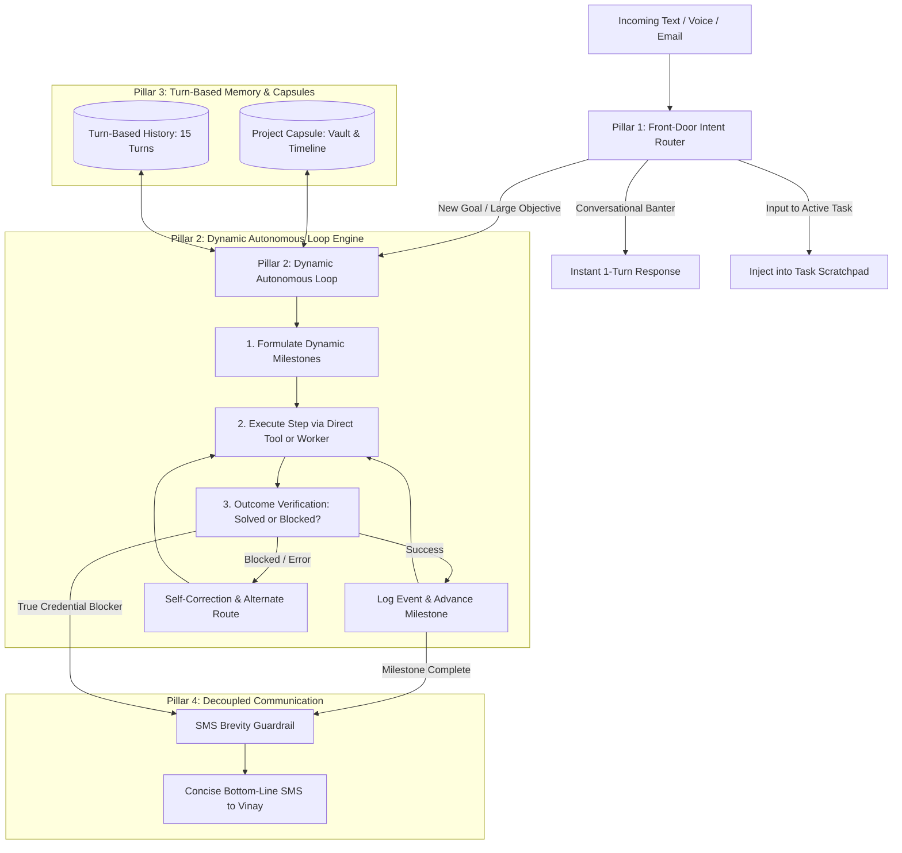

# Messa Autonomous V2: The Intelligent Personal Operator
**Architecture Specification & Engineering Blueprint**
*Target: "Throw anything at her, and she will handle it end-to-end autonomously."*

---

## 1. Vision & Core Philosophy

### The Goal
Messa is an **autonomous, intelligent, lightweight personal life manager**. When a user hands Messa a large, ambiguous, or multi-step goal (e.g., *"Find bank partners, verify their contacts, and reach out for partnership meetings"*), she does not ask for permission at every sub-step, drip-feed questions, or flood the user's phone with internal monologues. She takes the task completely off the user's plate, dynamically plans it, executes it using live tools, self-critiques and pivots around obstacles, and reports back only with concise, bottom-line milestone updates.

### Core Ideals
1. **Autonomous Execution First:** Bias toward action. Never ask permission to take the next logical step when the user already gave you the goal. Only pause if a hard physical barrier is reached (e.g., 2FA SMS code or user-held credentials).
2. **Dynamic Reasoning Over Hardcoded Flows:** No rigid workflow scripts. Every objective is broken down into dynamic milestones, and each step's outcome is verified (*"Did this form actually submit, or did it hit a CAPTCHA? Did this email bounce?"*).
3. **Reflective Intelligence (Modeled on Advanced Agent Systems):**
   * **Working Scratchpad:** Active task state, current milestone, proven facts, and obstacles.
   * **Loop: Plan $\rightarrow$ Act $\rightarrow$ Verify $\rightarrow$ Pivot.**
   * **Selective Communication:** Decouple internal thinking from texting. The user's phone is an executive communication channel, not a terminal console.
4. **Lightweight & Lean:** Zero bureaucratic subagent bloat. Tools that take 1 step should be direct function calls. Multi-step browser exploration remains an isolated worker.

---

## 2. The 5 Core Architectural Pillars

---

### Pillar 1: Front-Door Intent Router (Message Triage)
**Problem Solved:** Currently, every incoming text is dumped into the heavy orchestrator prompt with all tools loaded, causing stale approval re-checks and confusion over whether a text is conversational, a follow-up, or a new task.

**Design:**
Before running the full agent loop, a lightweight classifier (or fast model check) inspects the incoming text against the active user state:
1. **Context Check:** Does the user have an active project capsule or in-flight task?
2. **Intent Classification:**
   * **`ACTIVE_TASK_INPUT`**: The text provides information Messa asked for (e.g., *"Here is my phone: 2566942889"* or *"Use Messa email"*). $\rightarrow$ Feeds directly into the active task's scratchpad without re-evaluating the world.
   * **`NEW_GOAL`**: A new multi-step objective (e.g., *"Find bank partners..."*). $\rightarrow$ Creates/stages a Project Capsule and launches the autonomous loop.
   * **`STATUS_QUERY`**: Asking for progress (e.g., *"Any updates on the banks?"*). $\rightarrow$ Reads the project capsule timeline and returns an instant summary.
   * **`CHAT_BANTER`**: Casual interaction (e.g., *"Thanks!"*, *"Good morning"*). $\rightarrow$ Replies in 1 second without checking database action queues.

---

### Pillar 2: Dynamic Autonomous Loop Engine (Plan $\rightarrow$ Act $\rightarrow$ Verify)
**Problem Solved:** Messa currently executes linear tool calls. If something fails (like a reCAPTCHA block on Thread Bank), it either gives up or dumps the error on the user.

**Design:**
The Autonomous Loop runs continuously in the background on the server until the milestone is complete:
1. **Dynamic Milestones:**
   Messa generates 3–5 high-level milestones for any large task.
   *Example (Bank Outreach):*
   * *M1: Identify top 5 bank sponsor candidates & verified BD contact details.*
   * *M2: Validate intake method (web form vs. direct email).*
   * *M3: Dispatch outreach from primary inbox.*
   * *M4: Verify delivery (monitor bounces) & queue response watcher.*
2. **Action Execution:** Messa calls direct tools or delegates deep browser tasks.
3. **Outcome Critic (Did it work?):**
   * *Form submission:* Did the page show a confirmation banner, or did a reCAPTCHA/validation error appear?
   * *Email dispatch:* Was it accepted by the mail server? Did an immediate mailer-daemon bounce arrive?
4. **Dynamic Pivoting:**
   * If a portal is blocked by CAPTCHA $\rightarrow$ Automatically find the corporate BD email.
   * If an email bounces $\rightarrow$ Look up the VP of Partnerships on LinkedIn/web and route to their alternate address.
   * Only pause for the user if it hits a **true barrier** (needs a password or OTP SMS code).

---

### Pillar 3: True Turn-Based Memory & Capsule Context
**Problem Solved:** `limit=12` in `cli.py` evicted past actions within 90 seconds because SMS splitting created 4–8 rows per turn. Messa literally suffered from short-term memory loss.

**Design:**
1. **Turn-Based History Retrieval:**
   * Messages are aggregated into **Conversational Turns** (User prompt + Final synthesized assistant answer).
   * Messa always loads the last **15 full turns**, giving her complete awareness of everything discussed that day.
2. **Project Capsule Context Injection:**
   * If working on a project, the active **Project Capsule** is automatically injected into context:
     * **Goal & Scope**
     * **Timeline Events** (what was attempted, what succeeded, timestamps)
     * **Vault Assets** (links, PDF briefs, credentials)
   * Even across days or weeks, Messa can inspect the capsule and resume exactly where she left off.

---

### Pillar 4: Decouple "Thinking" from "Texting"
**Problem Solved:** In Turn 7, Messa sent 21 SMS messages in 4 minutes because intermediate thoughts, tool calls, and retries were streamed live to the user's phone.

**Design:**
1. **Silent Execution Engine:**
   * All intermediate ReAct thoughts, subagent outputs, search results, and form-filling steps run **silently** on the server.
   * `on_ai_message` does **not** stream internal thoughts to SMS.
2. **The Executive Update Contract:**
   * Messa communicates over SMS like an elite human Chief of Staff:
     * Only texts when a **milestone is accomplished** or an **action requires physical user input**.
     * Strictly concise: **1 to 2 sentences max**, stating the bottom line.
     * Links and rich content are unfurled cleanly on their own lines.
3. **Messa Controls Her Own Voice:**
   * Remove artificial prompts forcing third-person constraints (*"always write third-person on their behalf, never sign off as Vinay"*). Messa represents the user naturally.

---

### Pillar 5: Flattened, Lightweight Tool Belt
**Problem Solved:** 9 fragmented subagents created a "game of telephone," losing context and tripling latency (taking 3 LLM calls just to send one email).

**Design:**
* **Keep isolated workers ONLY for heavy exploratory jobs:**
  * `deepsearch`: Multi-step cloud browser navigation (Browserbase/Stagehand) where DOM trees and click sequences must remain isolated.
* **Convert single-shot micro-subagents into direct tools on Messa:**
  * `send_email(to, subject, body, from_inbox)` $\rightarrow$ Direct function call (defaults to user's primary Messa email).
  * `search_inbox(query)` $\rightarrow$ Direct search.
  * `manage_project_capsule(capsule_id, action, payload)` $\rightarrow$ Direct timeline & vault operations.
  * `create_reminder(time, task)` $\rightarrow$ Direct DB insert.
  * `generate_pdf(title, markdown_content)` $\rightarrow$ Direct synthesis.
* **Eliminate Stale Guardrails & Dead Code:**
  * Remove `ONE_TOUCH_APPROVAL_NUDGE` on ancient unconfirmed actions.
  * Delete dead `track_project` legacy tools.
  * Replace 6.0s LLM reaction classifier with instant fast-path regex tapbacks.

---

## 3. The Implementation Roadmap

| Phase | Component | Focus |
| :--- | :--- | :--- |
| **Phase 1** | **Memory & Context Engine** | Turn-based history aggregation (replacing `limit=12`), capsule auto-injection. |
| **Phase 2** | **Tool Flattening & Direct Actions** | Move email, reminders, and capsules directly to the orchestrator toolbelt; retire micro-subagents. |
| **Phase 3** | **Decoupled Communication & SMS Silencing** | Mute intermediate reasoning loops; enforce 1–2 sentence milestone SMS updates. |
| **Phase 4** | **Dynamic Autonomous Loop & Planner** | Plan $\rightarrow$ Act $\rightarrow$ Verify $\rightarrow$ Pivot engine with self-evaluating milestones. |
| **Phase 5** | **Front-Door Intent Router** | Lightweight triage router for fast conversational banter vs. active task resumption. |
| **Phase 6** | **Instant Tapbacks & Reaction Fast-Path** | 10ms pattern matcher for emojis (salute, checkmark, search) without OpenRouter timeouts. |
