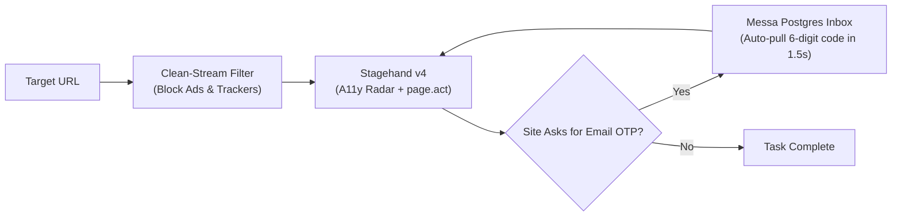

# Messa Deepsearch: Ultra-Speed Browsing Engine

A blueprint for making Messa's web browsing engine faster than human navigation, fully autonomous, and visually pristine in Live View by combining **Stagehand v4** with **Messa's Autonomous Infrastructure**.

---

## 1. Core Architecture: Stagehand v4 Engine + Messa Accelerators

Instead of building custom browser scrapers or managing low-level Playwright micro-steps, we use **Stagehand v4** (by Browserbase) as the underlying execution engine and supercharge it with Messa's proprietary services:

```
┌─────────────────────────────────────────────────────────────┐
│                 MESSA STRATEGIC DIRECTOR                    │
│      (Autonomous OTP Hook • Ad Blocker • User Profiles)     │
└──────────────────────────────┬──────────────────────────────┘
                               │ High-Level Intent
                               ▼
┌─────────────────────────────────────────────────────────────┐
│                     STAGEHAND v4 ENGINE                     │
│   • Native Browser Extension (Zero CDP Network Latency)     │
│   • 1-Turn Compound Actions: page.act("sign up with email") │
│   • Instant Schema Extraction: page.extract({ user_data })  │
│   • C++ Accessibility Tree Radar: page.observe()            │
└──────────────────────────────┬──────────────────────────────┘
                               │ Remote Session
                               ▼
┌─────────────────────────────────────────────────────────────┐
│               BROWSERBASE CLOUD INFRASTRUCTURE              │
│   • Remote Chromium (Zero RAM bloat on Messa Server)        │
│   • Clean-Stream Filter (uBlock / EasyList Rules)           │
│   • Live View WebRTC Streaming (<100ms Latency)             │
│   • Persistent Session Contexts (Saved Logins & Cookies)    │
└─────────────────────────────────────────────────────────────┘
```

---

## 2. The 5 Core Upgrades

### Upgrade 1: Clean-Stream Ad & Tracker Filtering (Fast & Visually Beautiful)
* **What it is:** Accelerates page loads by $3\times$ while keeping 100% of website images, logos, styling, and animations intact for the user watching in Live View.
* **How we do it:** Modern sites load slowly because of 30+ third-party ad networks, analytics beacons (Google Tag Manager, Hotjar), and video trackers. We inject a lightweight ad/tracker filter list (uBlock / EasyList rules) into the Browserbase session.
* **Result:** Pristine visual Live View with zero ad lag and fast rendering.

### Upgrade 2: Sub-10ms Native Element Radar (Stagehand v4 Extension)
* **What it is:** Discards 50,000 lines of messy HTML wrapper code and extracts actionable buttons, inputs, and forms in under 10 milliseconds.
* **How we do it:** Stagehand v4 runs as a native extension inside Chrome, directly reading Chrome's C++ Accessibility (A11y) tree.
* **Result:** Eliminates the "agent thinking for 5 seconds between clicks" bottleneck. The LLM receives a clean 500-token action map in a single pass.

### Upgrade 3: Autonomous Zero-Human OTP / Email Verification
* **What it is:** Messa creates accounts and logs in autonomously without stopping to ask the user: *"Please check your email and send me the code."*
* **How we do it:** Messa already provisions `@textmessa.com` user emails and routes inbound mail via Cloudflare into our PostgreSQL `emails` table. When Stagehand hits an OTP screen:
  1. Deepsearch enters the user's `@textmessa.com` email and clicks "Send Code".
  2. Messa calls `pull_recent_otp()`, querying the database for incoming mail from that domain.
  3. A regex parser extracts the 6-digit code or magic link within 1.5 seconds.
  4. Stagehand fills the code: `page.act(f"enter code {otp} and submit")`.
* **Result:** Signups complete in under 10 seconds with zero human intervention.

### Upgrade 4: Instant Cookie & Modal Dismissal (Background Interceptor)
* **What it is:** Automatically dismiss cookie consent banners, newsletter popups, and location modals before they block the AI agent.
* **How we do it:** 
  * **Browserbase Persistent Contexts:** Saves session cookies and `localStorage` so cookie banners are accepted once and never appear again on repeat visits.
  * **Auto-Dismiss Hook:** A lightweight script auto-clicks `Accept All`, `Agree`, or `✕` the microsecond an overlay mounts.
* **Result:** Eliminates popup blockers and "element intercepted" click failures.

### Upgrade 5: Real-Time Form Validation Error Watcher
* **What it is:** Instantly detects form submission errors (e.g., *"Password must include a special character"*, *"Email already exists"*) without re-scanning the whole page.
* **How we do it:** When submitting a form, a DOM listener watches for `[aria-invalid="true"]`, `.error`, or toast alerts, returning the exact error text directly to the agent.
* **Result:** Immediate error recovery on the very next turn instead of getting stuck in loops.

---

## 3. Multi-User & Multi-Agent Scalability (Zero Server Bloat)

* **Runs in Browserbase Cloud:** All Chromium browser instances, DOM parsing, and video streams run remotely on Browserbase infrastructure—**not on Messa's server**.
* **Ultra-Low Server Footprint:** On our server, each Stagehand agent is just a lightweight Python `asyncio` coroutine using **~15–25 MB of RAM**.
  * 50 concurrent active users running browsing agents simultaneously consume **< 1.2 GB of RAM** on our server.
* **Strict Sandboxing:** Each user session has an isolated `session_id`. Cookies, local storage, and tabs never leak between users or sub-agents.
* **Cost Controls:** Enforce per-user concurrency caps (e.g. max 2 browser agents per user) and a strict 5-minute idle TTL to prevent orphaned cloud spend.

---

## 4. Execution Flow



---

## 5. Implementation Plan

* **Phase 1: Stagehand v4 Integration & Clean-Stream**
  * Install `stagehand` Python SDK and connect to Browserbase sessions.
  * Configure uBlock / EasyList tracker blocking on Browserbase sessions.
* **Phase 2: Autonomous OTP Engine**
  * Implement `pull_recent_otp(user_id, service_domain)` reading from PostgreSQL `emails` table.
  * Wire OTP auto-fill into Stagehand's action loop.
* **Phase 3: Persistent Contexts & Validation Watcher**
  * Enable Browserbase Contexts per user for cookie persistence.
  * Attach the real-time form validation error listener.

---

## 6. Expected Impact

| Metric | Current Deepsearch | With Stagehand v4 + Messa |
| :--- | :--- | :--- |
| **Page Load Time** | 2.5 – 4.0 seconds | **0.6 – 1.0 second** (Ad/tracker bloat stripped) |
| **Form Filling** | 5 – 8 separate turns (15–25s) | **1 single turn (1.5s)** via `page.act` |
| **Account Creation / Signup** | 2 – 5 minutes (Manual human OTP loop) | **< 10 seconds** (Autonomous email verification) |
| **Live View Quality** | Standard | **100% full visual fidelity (clean, ad-free)** |
| **Server RAM Footprint** | Low | **Ultra-low (~20 MB per active agent)** |
